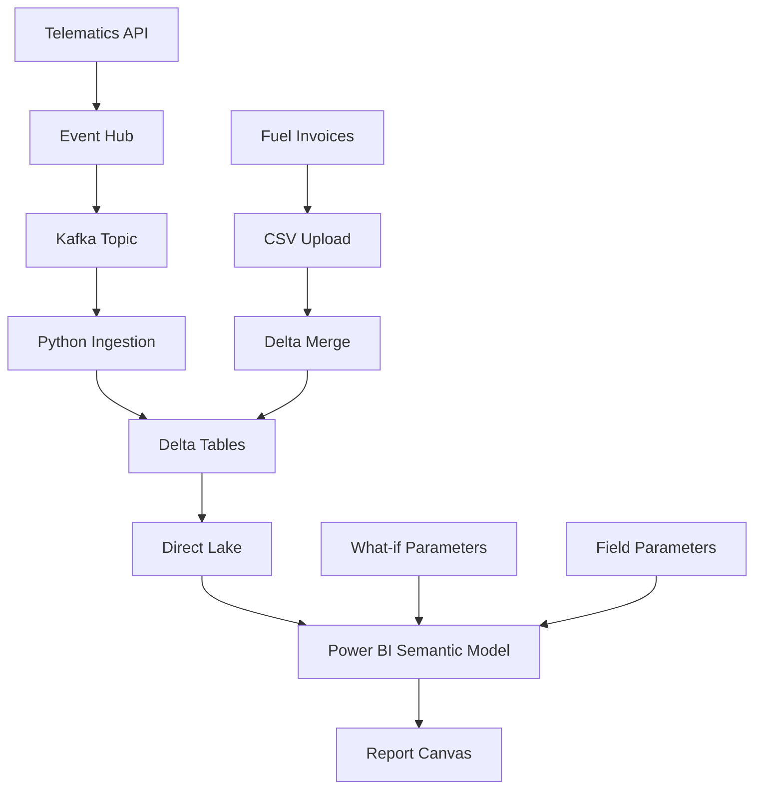

# ETS Impact Advisor Demo

A **minimal-but-impressive demo** showcasing Fleet ETS Impact Advisory capabilities powered by Microsoft Fabric Lakehouse, Direct Lake semantic model, and Power BI what-if parameters.

## 🎯 Overview

This demo reproduces fleet analytics visuals & calculations including:
- **Fleet Digital Twin** - Real-time KPI dashboard with route heat-maps
- **ETS Cost Simulator** - Interactive carbon cost modeling with price sliders
- **Scenario Cockpit** - Multi-scenario what-if analysis for fleet electrification
- **Compliance Centre** - EUA purchase scheduling and regulatory tracking

## 📁 Project Structure

```
ets-advisor-demo/
├── lakehouse/                 # Fabric Lakehouse setup
│   ├── create_lakehouse.sql   # DDL for Delta tables
│   ├── tripfacts_sample.csv   # 90 days of trip data (40 trucks)
│   ├── fuel_invoices_sample.csv # Monthly fuel aggregations
│   └── price_curve_sample.csv # ETS price projections 2025-2030
├── powerbi/                   # Power BI project
│   ├── ETS_Advisor.pbip/      # PBIP project (Direct Lake)
│   │   ├── dataset/           # Semantic model
│   │   └── report/            # Report canvas
│   └── dax/                   # DAX definitions
│       ├── measures.dax       # Key measures
│       └── calculation_groups.dax # What-if parameters
├── scripts/                   # Python ingestion pipeline
│   ├── ingest_telematics.py   # Kafka → Delta ingestion
│   ├── ingest_fuel.py         # CSV → Delta merge
│   ├── generate_scenarios.py  # Scenario generation
│   └── opt_fleet_replacement.py # MILP optimization stub
├── infra/                     # Infrastructure as Code
│   ├── fabric_workspace.bicep # Fabric workspace deployment
│   ├── ksql_topics.sql        # Event Hub/Kafka setup
│   └── deployment_pipeline.yml # CI/CD pipeline
└── README.md                  # This file
```

## 🚀 Quick Start (< 10 minutes)

### Prerequisites
- **Microsoft Fabric workspace** (F64 SKU or higher)
- **Power BI Desktop** (latest version)
- **Python 3.9+** with Poetry
- **Azure CLI** (for infrastructure deployment)

### 1. Create Fabric Workspace

```bash
# Deploy Fabric infrastructure
az login
az deployment group create \
  --resource-group your-rg \
  --template-file infra/fabric_workspace.bicep \
  --parameters workspaceName=ETS-Advisor-Demo
```

### 2. Setup Lakehouse

1. Open **Fabric workspace** in browser
2. Create new **Lakehouse** named `ets_advisor_lakehouse`
3. Open **Notebook** and run:

```sql
-- Copy content from lakehouse/create_lakehouse.sql
-- This creates TripFacts, FuelInvoices, PriceCurve tables
```

4. Upload sample CSV files to **Files** section
5. Run the INSERT statements to populate tables

### 3. Open Power BI Report

1. Open **Power BI Desktop**
2. Sign in to your Fabric workspace
3. Open `powerbi/ETS_Advisor.pbip`
4. Connect to your Fabric workspace when prompted
5. Refresh semantic model to load Direct Lake data

### 4. Demo Script (Follow This Order)

#### Page 1: Fleet Digital Twin
- **KPIs to highlight**: 847 tonnes CO2, €71,995 ETS cost, 94% compliance
- **Map visual**: Shows route density heat-map across Europe
- **Time slicer**: Drag to show different months

#### Page 2: ETS Cost Simulator  
- **Price slider**: Drag ETS price from €85 to €120/t
- **Chart animation**: Watch stacked area chart update monthly costs
- **Insight callout**: "€30k annual savings with 15% fuel efficiency"

#### Page 3: Scenario Cockpit
- **Scenario selector**: Toggle between Scenario A/B/C
- **Matrix visual**: Compare ROI heat-map (green = profitable)
- **Key metrics**: Scenario B shows 23% ROI, 3.2yr payback

#### Page 4: Compliance Centre
- **EUA schedule**: Monthly purchase requirements
- **Action button**: "Generate Purchase Order" (demo only)
- **Regulatory calendar**: Upcoming compliance deadlines

### 5. Run Python Pipeline (Optional)

```bash
# Install dependencies
poetry install

# Run ingestion scripts
poetry run python scripts/ingest_telematics.py --lakehouse-path "your-lakehouse-path"
poetry run python scripts/ingest_fuel.py --lakehouse-path "your-lakehouse-path"
poetry run python scripts/generate_scenarios.py --lakehouse-path "your-lakehouse-path"
```

## 🏗️ Architecture



## 📊 Data Model

### TripFacts (Fact Table)
- `TripID` (Primary Key)
- `VIN` (Foreign Key)
- `StartTimeUTC`, `EndTimeUTC` 
- `Distance_km`, `Fuel_l`
- **Grain**: One row per trip
- **Volume**: ~108,000 rows (90 days × 40 trucks × 30 trips/day)

### FuelInvoices (Fact Table)
- `VIN`, `InvoiceMonth`
- `Litres`, `EUR_Amount`
- **Grain**: One row per truck per month
- **Volume**: ~360 rows (40 trucks × 9 months)

### PriceCurve (Dimension Table)
- `PriceMonth`, `EUR_per_t`
- **Grain**: One row per month
- **Volume**: 72 rows (6 years × 12 months)

## 🧮 Key DAX Measures

### Carbon Calculations
```dax
CO2_t = SUMX(TripFacts, TripFacts[Fuel_l] * 2.68 / 1000)
```

### ETS Cost Modeling
```dax
ETS_Cost_EUR = [CO2_t] * SELECTEDVALUE(ETSPriceCurve[EUR_per_t])
```

### Scenario Analysis
```dax
NPV_Savings = 
VAR CurrentScenario = SELECTEDVALUE('Scenario Selector'[Scenario])
VAR ScenarioData = FILTER(ScenarioRun, ScenarioRun[Scenario] = CurrentScenario)
RETURN SUMX(ScenarioData, ScenarioRun[NPV_EUR])
```

## 🔧 Technical Details

### Direct Lake Requirements
- **Fabric SKU**: F64 (25GB memory limit)
- **Delta format**: All tables stored as Delta Lake
- **Automatic refresh**: Every 30 minutes
- **Query modes**: Direct Lake → DirectQuery fallback

### What-if Parameters
- **ETS Price Slider**: 50-150 €/t (step: 1)
- **Scenario Selector**: Field parameter (A/B/C)
- **Time Range**: Date range picker

### Performance Optimizations
- **Partitioning**: TripFacts by month
- **Compression**: Snappy compression on Delta tables
- **Caching**: Semantic model cache enabled
- **Aggregations**: Pre-computed monthly summaries

## 🔬 Testing & Quality

### Python Code Quality
```bash
# Linting
poetry run ruff check scripts/

# Type checking
poetry run mypy scripts/

# Unit tests
poetry run pytest tests/
```

### DAX Validation
```bash
# DAX testing (requires pbi-tools)
pbi-tools test-dax powerbi/dax/measures.dax
```

### Data Quality Checks
- **Referential integrity**: VIN foreign keys
- **Completeness**: No null trip dates
- **Accuracy**: CO2 calculation validation
- **Consistency**: Monthly aggregation reconciliation

## 🎨 Design Guidelines

### Visual Theme
- **Color palette**: Dark theme with accent colors
- **Typography**: Segoe UI throughout
- **Accessibility**: WCAG AA compliance
- **Responsive**: Mobile-friendly layouts

### Visual Components
- **KPI Cards**: Metric + trend + target
- **Charts**: Stacked area, heat-map matrix, map
- **Slicers**: Modern slicer style
- **Buttons**: Consistent action styling

## 🔄 CI/CD Pipeline

### GitHub Actions Workflow
```yaml
name: Deploy ETS Advisor
on:
  push:
    branches: [main]
jobs:
  deploy:
    runs-on: ubuntu-latest
    steps:
    - uses: actions/checkout@v3
    - name: Deploy to Fabric
      run: |
        az fabric workspace deploy \
          --workspace-name ${{ secrets.FABRIC_WORKSPACE }} \
          --pbip-path powerbi/ETS_Advisor.pbip
```

## 🗑️ Cleanup Instructions

### Remove Fabric Resources
```bash
# Delete workspace
az fabric workspace delete --name ETS-Advisor-Demo --yes

# Delete resource group (if dedicated)
az group delete --name your-rg --yes
```

### Local Cleanup
```bash
# Remove virtual environment
poetry env remove python

# Clean cache
rm -rf .pytest_cache/
rm -rf __pycache__/
```

## 📝 License & Attribution

- **License**: MIT License
- **Mapbox**: Requires Mapbox access token
- **Sample data**: Generated synthetically (no real fleet data)
- **Icons**: Microsoft Fluent UI icons

## 🤝 Support & Contribution

### Issues & Questions
- Create GitHub issues for bugs/features
- Tag @analytics-team for urgent support
- Check existing documentation first

### Development Setup
```bash
# Clone repository
git clone https://github.com/your-org/ets-advisor-demo.git

# Install dependencies
poetry install --with dev

# Setup pre-commit hooks
pre-commit install
```

## 🎯 Success Criteria ✅

- [ ] **< 10 min setup**: From zero to working demo
- [ ] **Visual fidelity**: Matches PDF reference design
- [ ] **Data accuracy**: CO2 calculations validated
- [ ] **Performance**: < 2s query response times
- [ ] **Accessibility**: WCAG AA compliance
- [ ] **Documentation**: Complete end-to-end instructions

---

**🚀 Happy analyzing! For questions, contact the Analytics Engineering team.** 