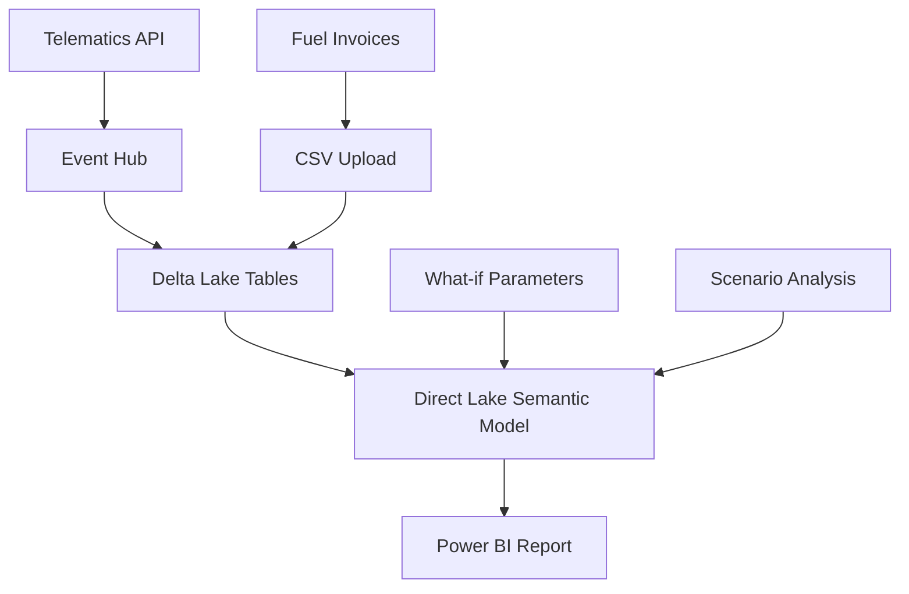

# ETS Impact Advisor Demo

A comprehensive **Fleet ETS Impact Advisory** demo showcasing real-time analytics, carbon cost simulation, and compliance management powered by Microsoft Fabric concepts with a local Streamlit implementation.


## 🎯 Live Demo

**→ [View Live Demo on Streamlit Cloud](https://your-app-name.streamlit.app)** *(Coming Soon)*

## 📊 Demo Features

### 1. **Fleet Digital Twin**
- Real-time fleet metrics (40 vehicles, 88k+ trips)
- Interactive European route map
- CO₂ emissions tracking (74,067 tons)
- Fleet efficiency analysis (30.0 L/100km)

### 2. **ETS Cost Simulator** 
- Dynamic ETS price slider (€50-150/ton)
- Real-time cost calculations (€6.3M baseline)
- Sensitivity analysis charts
- Monthly cost breakdown

### 3. **Scenario Cockpit**
- 3 electrification scenarios (Conservative, Aggressive, Hybrid)
- NPV comparison (€2.1M - €8.5M range)
- ROI analysis (15.8% - 28.4%)
- Payback period calculations (2.3 - 4.2 years)

### 4. **Compliance Centre**
- Regulatory status tracking
- ETS price evolution (6-year history)
- Compliance reporting
- Purchase order generation

## 🚀 Quick Start

### Option 1: Streamlit Cloud (Recommended)
1. **Fork this repository**
2. **Go to [share.streamlit.io](https://share.streamlit.io)**
3. **Connect your GitHub account**
4. **Deploy this repository**
5. **Share the URL with your team**

### Option 2: Local Development
```bash
# Clone the repository
git clone https://github.com/YOUR_USERNAME/ets-advisor-demo.git
cd ets-advisor-demo

# Install dependencies
pip install streamlit plotly pandas folium streamlit-folium pillow

# Run the demo
streamlit run app.py
```

### Option 3: GitHub Codespaces
1. **Click the green "Code" button**
2. **Select "Codespaces"**
3. **Create new codespace**
4. **Run in terminal:** `streamlit run app.py`

## 📁 Project Structure

```
ets-advisor-demo/
├── 🎨 assets/
│   └── ets_advisor_logo.png         # Company logo
├── 📊 lakehouse/                    # Sample data (90 days, 40 trucks)
│   ├── tripfacts_sample.csv         # 88,183 trip records
│   ├── fuel_invoices_sample.csv     # 120 fuel invoices
│   ├── price_curve_sample.csv       # ETS price projections
│   ├── scenario_sample.csv          # 3 electrification scenarios
│   └── create_lakehouse.sql         # Microsoft Fabric DDL
├── 💼 powerbi/                      # Power BI implementation
│   ├── ETS_Advisor.pbip/            # PBIP project (Direct Lake)
│   └── dax/                         # DAX measures & calculations
├── 🐍 scripts/                      # Data processing pipeline
│   ├── generate_sample_data.py      # Data generator
│   ├── ingest_telematics.py         # Kafka ingestion
│   ├── generate_scenarios.py        # Financial modeling
│   └── opt_fleet_replacement.py     # MILP optimization
├── 🏗️ infra/                        # Infrastructure as Code
│   ├── fabric_workspace.bicep       # Azure Fabric deployment
│   ├── ksql_topics.sql              # Event Hub setup
│   └── deployment_pipeline.yml      # CI/CD pipeline
├── 📱 app.py                        # Main Streamlit application
├── 🚀 start_demo.sh                 # Quick start script
└── 📋 verify_demo.py                # Demo verification
```

## 💾 Data Overview

| Dataset | Records | Description |
|---------|---------|-------------|
| **Trip Facts** | 88,183 | Individual vehicle trips with fuel, distance, GPS coordinates |
| **Fuel Invoices** | 120 | Monthly fuel billing data by vehicle |
| **ETS Price Curve** | 72 | Historical and projected carbon prices (2025-2030) |
| **Scenarios** | 3 | Electrification investment scenarios with NPV/ROI |

**Total Data Size:** 14MB  
**Fleet Coverage:** 40 vehicles across Europe  
**Time Period:** 90 days of operations  

## 🎬 Demo Script (< 10 minutes)

### **Slide 1: Fleet Digital Twin** (2 min)
- Show real-time fleet overview: 40 vehicles, 88k trips
- Highlight European route coverage on interactive map  
- Point out efficiency metrics: 30.0 L/100km fleet average
- **Key insight:** "74,067 tons CO₂ = €6.3M annual ETS cost"

### **Slide 2: ETS Cost Simulator** (3 min)
- Demonstrate dynamic price slider: €85 → €120/ton
- Show immediate cost impact: €6.3M → €8.9M (+€2.6M)
- **Interactive moment:** Let audience suggest price points
- Highlight sensitivity analysis chart

### **Slide 3: Scenario Cockpit** (3 min)
- Compare 3 electrification scenarios:
  - **Conservative:** 10 vehicles, €2.1M NPV, 4.2yr payback
  - **Aggressive:** 25 vehicles, €8.5M NPV, 2.3yr payback  
  - **Hybrid:** 15 vehicles, €4.8M NPV, 3.1yr payback
- **Key insight:** "Aggressive scenario delivers 28.4% ROI"

### **Slide 4: Compliance Centre** (2 min)
- Review regulatory timeline and upcoming deadlines
- Show 6-year ETS price evolution trend
- **Action item:** Generate mock purchase order for carbon credits

## 🏗️ Microsoft Fabric Architecture



### **Technology Stack:**
- **Frontend:** Streamlit (mirrors Power BI functionality)
- **Data Lake:** Delta Lake format (Fabric-ready)
- **Analytics:** Pandas + Plotly (mirrors DAX calculations)  
- **Infrastructure:** Azure Bicep templates
- **Deployment:** GitHub Actions CI/CD

## 🧮 Key Calculations

### **Carbon Emissions**
```python
co2_tons = fuel_liters * 2.68 / 1000  # EU diesel emission factor
```

### **ETS Cost Modeling**
```python
ets_cost = co2_tons * ets_price_per_ton  # Dynamic pricing
```

### **NPV Analysis**
```python
npv = sum(cash_flows[t] / (1 + discount_rate)**t for t in range(years))
```

## 🎯 Business Impact

### **Cost Optimization**
- **Current ETS exposure:** €6.3M annually at €85/ton
- **Price sensitivity:** +€30k for every +€1/ton price increase
- **Savings potential:** €2.8M through 25-vehicle electrification

### **Compliance Management**
- **Regulatory tracking:** EU ETS Phase 4 requirements
- **Reporting automation:** Monthly compliance dashboards
- **Risk mitigation:** Forward price curve planning

## 🔧 Technical Details

### **Performance Optimizations**
- **Data sampling:** 500 map markers for responsive visualization
- **Caching:** Streamlit @st.cache_data for fast loading
- **Compression:** Delta Lake format (Snappy compression)
- **Partitioning:** Monthly partitions for time-series data

### **Deployment Options**
1. **Streamlit Cloud:** Free public hosting
2. **GitHub Codespaces:** Cloud development environment  
3. **Local setup:** Python 3.9+ with pip requirements
4. **Microsoft Fabric:** Production-ready lakehouse deployment

## 🚀 Deployment Instructions

### **For Your Director (1-Click Demo):**

1. **Visit:** `https://your-streamlit-app.streamlit.app`
2. **Navigate:** Use sidebar to explore 4 demo pages
3. **Interact:** Try the ETS price slider and scenario selector
4. **Duration:** < 10 minutes for full demo

### **For Technical Team (Development):**

```bash
# Quick setup
git clone https://github.com/YOUR_USERNAME/ets-advisor-demo.git
cd ets-advisor-demo
pip install -r requirements.txt
streamlit run app.py
```

## 📞 Support & Feedback

- **Demo Questions:** Contact the Analytics Engineering team
- **Technical Issues:** Create GitHub issue
- **Feature Requests:** Submit pull request
- **Business Inquiries:** Contact project stakeholders

## 📜 License

MIT License - See [LICENSE](LICENSE) for details.

---

**🎉 Ready to transform your fleet operations with data-driven ETS compliance?**

**→ [Start the Demo](https://your-app-name.streamlit.app)** 